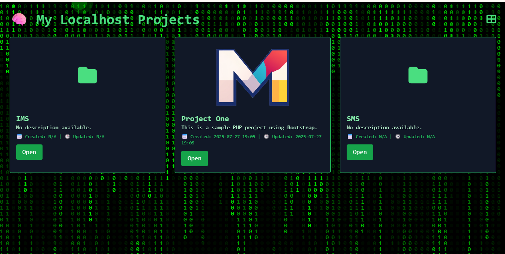

# CustomLocalhostEnvironmentSetup

An interactive, hacker-themed **localhost dashboard** for XAMPP environments that automatically lists all projects inside the `htdocs/` directory. Featuring grid/list toggle views, project thumbnails, creation and update timestamps, ripple cursor effects, and a matrix-style animated background—all styled with TailwindCSS.

---

## 🚀 Demo


*Demo GIF or screen recording showing grid/list toggle, ripple effect, and matrix animation.*

---

## 🧩 Features

- Auto-detects all project folders inside XAMPP's `htdocs/` directory.
- Displays project name, description, icon, thumbnail (from optional `config.json`).
- Shows project creation and last modified timestamps based on main index files.
- Toggle between **Grid** and **List** views with icon buttons.
- Stylish animations:
  - Matrix-style background effect.
  - Ripple cursor effect on mouse move.
- Responsive and modern UI built with TailwindCSS.
- Uses FontAwesome icons for project visuals.
- Securely restricts access to localhost only.

---

## 🛠 Installation & Setup

### Requirements

- XAMPP installed and running.
- PHP enabled (default in XAMPP).
- Projects placed inside the `htdocs/` directory.

### Steps

1. **Download or clone the repository** into your XAMPP `htdocs/` folder (or any subfolder):

   ```bash
   cd /path/to/xampp/htdocs/
   git clone https://github.com/yourusername/CustomLocalhostEnvironmentSetup.git
  
2. Backup your existing index.php in htdocs/ (if any).

3. Copy index.php from this repo to your htdocs/ root folder:

    ```bash
    cp CustomLocalhostEnvironmentSetup/index.php
    ```

4. (Optional) Add config.json files in your project folders to customize their display.

    Example config.json:

          {
            "name": "Awesome App",
            "description": "A cool app running locally.",
            "icon": "fa-rocket",
            "thumbnail": "thumb.png"
          }
    
5. Open your browser and navigate to http://localhost/ to see the dashboard.

⚙️ Customization
Modify index.php to add features or change styling.

TailwindCSS can be configured via CDN or local build.

Customize icons via FontAwesome.

Add README.md parsing for richer descriptions using PHP Markdown libraries.

Add authentication if sharing on a local network.

🔐 Security
Access is restricted to localhost only by default:

  ```php

      if ($_SERVER['REMOTE_ADDR'] !== '127.0.0.1' && $_SERVER['REMOTE_ADDR'] !== '::1') {
        http_response_code(403);
        die('Access forbidden: Localhost only');
      }
  ```
💡 Future Ideas
Search/filter projects.

Real-time Git status or activity monitoring.

Light/dark mode toggle.

Markdown README rendering.

IP whitelisting and password protection.

Drag & drop reordering.

🙌 Contributions
Feel free to fork and submit pull requests! Open to feature requests and improvements.

📄 License
This project is licensed under the MIT License.

  ```text

      MIT License
      
      Copyright (c) 2025 GahaBitCraft
      
      Permission is hereby granted, free of charge, to any person obtaining a copy
      of this software and associated documentation files (the "Software"), to deal
      in the Software without restriction, including without limitation the rights
      to use, copy, modify, merge, publish, distribute, sublicense, and/or sell 
      copies of the Software, and to permit persons to whom the Software is 
      furnished to do so, subject to the following conditions:
      
      The above copyright notice and this permission notice shall be included in all 
      copies or substantial portions of the Software.
      
      THE SOFTWARE IS PROVIDED "AS IS", WITHOUT WARRANTY OF ANY KIND, EXPRESS OR 
      IMPLIED, INCLUDING BUT NOT LIMITED TO THE WARRANTIES OF MERCHANTABILITY, 
      FITNESS FOR A PARTICULAR PURPOSE AND NONINFRINGEMENT. IN NO EVENT SHALL THE 
      AUTHORS OR COPYRIGHT HOLDERS BE LIABLE FOR ANY CLAIM, DAMAGES OR OTHER 
      LIABILITY, WHETHER IN AN ACTION OF CONTRACT, TORT OR OTHERWISE, ARISING FROM, 
      OUT OF OR IN CONNECTION WITH THE SOFTWARE OR THE USE OR OTHER DEALINGS IN THE 
      SOFTWARE.
   ``` 

🧑‍💻 GitHub Repo Setup & First Commit Instructions
  ```bash

      # Navigate to your htdocs folder or wherever you want to create repo
      cd /path/to/xampp/htdocs/
      
      # Initialize new git repo
      git init
      
      # Add your index.php and README.md and LICENSE files
      git add index.php README.md LICENSE
      
      # Commit the files
      git commit -m "Initial commit: Add CustomLocalhostEnvironmentSetup dashboard"
      
      # Create GitHub repo online named "CustomLocalhostEnvironmentSetup" (via GitHub UI)
      
      # Add remote origin (replace yourusername)
      git remote add origin https://github.com/yourusername/CustomLocalhostEnvironmentSetup.git
      
      # Push to GitHub main branch
      git branch -M main
      git push -u origin main
  ```
